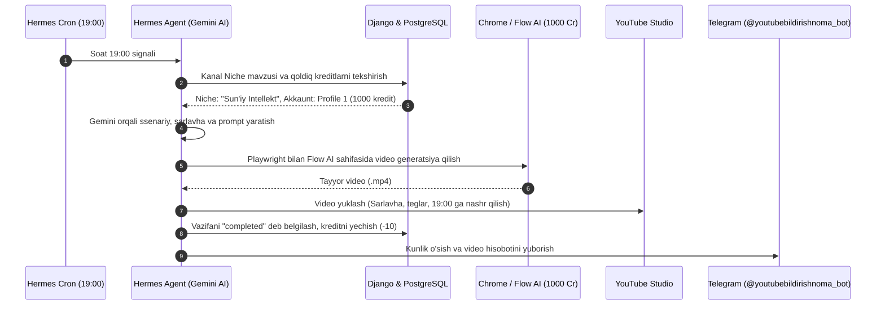

# 🏛 Tizim Arxitekturasi va Dasturiy Dizayn (Architecture & Design)

Ushbu hujjat **YouTube Avtomatlashtirish & Content-Factory** tizimining texnik arxitekturasi, ma'lumotlar oqimi, xavfsizlik choralari va tizim integratsiyasini batafsil tushuntiradi.

---

## 1. Umumiy Arxitektura Qatlamlari (Layered Architecture)

Tizim modulli monolit (Django) va alohida statik SPA (React + TypeScript) formatida loyihalashtirilgan:

```text
[ Brauzer / Foydalanuvchi ]          [ Telegram Foydalanuvchi ]
            │                                     │
            ▼                                     ▼
┌─────────────────────────┐           ┌─────────────────────────┐
│   Nginx Reverse Proxy   │           │   Hermes Agent Gateway  │
│   Port 80 (HTTP / SSL)  │           │   (Systemd Service)     │
└───────────┬─────────────┘           └───────────┬─────────────┘
            │                                     │
    ┌───────┴───────┐                             │
    ▼               ▼                             │
┌────────┐    ┌──────────┐                        │
│ React  │    │  Django  │                        │
│ Frontend    │  Gunicorn│◄───────────────────────┘ (Internal API / CLI)
└────────┘    └─────┬────┘
                    │
                    ▼
          ┌──────────────────┐
          │   PostgreSQL 16  │
          │   (Multi-model)  │
          └──────────────────┘
```

---

## 2. Ma'lumotlar Modeli (Data Modeling)

Barcha ma'lumotlar `apps.youtube` ilovasida PostgreSQL cheklovlari (CheckConstraint, UniqueConstraint) bilan himoyalangan:

1. **`FlowAIAccount`**:
   - `profile_dir`: Chrome profil papkasi (masalan: `Profile 1`, `Profile 3`, `Profile 4`, `Profile 6`).
   - `credits_remaining`: Qoldiq kredit (1000 dan boshlanadi).
   - `CheckConstraint(credits_remaining >= 0)`: Kreditlar manfiy bo'lib ketmasligi kafolatlangan.

2. **`ChannelNiche`**:
   - `niche_name`: 1 ta qat'iy yo'nalish nomi.
   - `prompt_guidelines`: Gemini uchun ssenariy va vizual ko'rsatmalar.

3. **`VideoGenerationTask`**:
   - Flow AI orqali generatsiya qilingan har bir videoning to'liq hayot siklini (`queued` -> `generating` -> `completed` -> `failed`) audit qiladi.

4. **`ScheduledUpload`**:
   - Har bir video uchun 19:00 dagi aniq slotni belgilaydi.
   - `UniqueConstraint(['channel', 'scheduled_date', 'scheduled_time'])`: Bir vaqtning o'zida ikkita video to'qnash kelishining oldi olingan.

5. **`DailyChannelAnalytics`**:
   - Kunlik prosmotrlar, obunachilar va ularning o'sish dinamikasini saqlaydi. Telegramga hisobot yuborilganligini qayd etadi.

---

## 3. Avtomatlashtirish & Sun'iy Intellekt Konveyeri (AI Pipeline)



---

## 4. Xavfsizlik Tamoyillari (Security Hardening)

1. **IDOR (Insecure Direct Object References) Himoyasi:**
   - Foydalanuvchilar faqat o'zlariga tegishli kanallar, playlistlar va vazifalarni boshqara oladi (`IsOwnerOrReadOnly`).
2. **API Kalitlar Himoyasi:**
   - `GEMINI_API_KEY` va `TELEGRAM_BOT_TOKEN` faqat server muhitida (`.env`) saqlanadi, mijoz brauzeriga (frontend) hech qachon oshkor qilinmaydi.
3. **Regex Sanitization:**
   - Barcha YouTube identifikatorlari faqat ruxsat etilgan lotin alifbosi, raqamlar va chiziqchalar bilan qat'iy tekshiriladi (`YOUTUBE_ID_PATTERN`).
4. **N+1 Query Optimization:**
   - ViewSet'lar `select_related` va `prefetch_related` hamda `Count` agregatsiyalari bilan yozilgan bo'lib, bazaga yuklamani minimal darajaga tushiradi.

---

## 5. Laptop Server Rejimi va Nosozliklarga Chidamlilik (Resilience)

- **Power Management:** XFCE va systemd sozlamalarida `lid-action` va `inactivity` 0 ga tenglashtirilgan.
- **Docker Auto-Restart:** `restart: unless-stopped` — server qayta yuklanganda DB, Backend, Frontend va Nginx avtomatik ishga tushadi.
- **Systemd Linger:** `logind` linger yoqilgan, foydalanuvchi tizimdan chiqqan taqdirda ham Hermes Gateway fonda uzluksiz ishlaydi.
